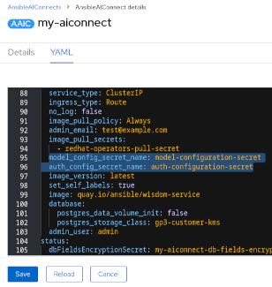

# Using external configuration `Secret`'s

## Overview

Configuration parameters for the both the authentication backend and model service **must** be provided using `Secret`'s.

## Authentication `Secret`

`auth_config_secret_name` should be set to the name of an existing `Secret`. The Operator will use the values set therein to configure the authentication backend integration. The `Secret` must contain the following values:
```yaml
apiVersion: v1
kind: Secret
metadata:
  name: <secret-name>-auth-configuration
  namespace: <target-namespace>
stringData:
  auth_api_url: <Authentication service URL>
  auth_api_key: <Authentication service API Key>
  auth_api_secret: <Authentication service API Secret>
  auth_verify_ssl: <boolean>
  auth_allowed_hosts: <domains>
type: Opaque
```
Set `auth_verify_ssl` to pass the `verify` parameter to HTTP requests made by the service. A value of `True` is recommended for use in production. See [here](https://python-social-auth.readthedocs.io/en/latest/configuration/settings.html#processing-requests-and-redirects) for details.

`auth_allowed_hosts` contains a list of strings representing the host/domain names that this service can serve. A wildcard `*` can be used to grant access to all hosts sending requests to the service however this is not recommended nor encouraged for production. See [here](https://docs.djangoproject.com/en/5.0/ref/settings/#allowed-hosts) for details.

The `AnsibleAIConnect` configuration would look like this:
```yaml
apiVersion: aiconnect.ansible.com/v1alpha1
kind: AnsibleAIConnect
metadata:
  name: <instance-name>
  namespace: <target-namespace>
spec:
  ...
  auth_config_secret_name: <secret-name>-auth-configuration
```

## Model service `Secret`

`model_config_secret_name` should be set to the name of an existing `Secret`. The Operator will use the values set therein to configure the model service integration. The `Secret` must contain the following values:
```yaml
apiVersion: v1
kind: Secret
metadata:
  name: <secret-name>-model-configuration
  namespace: <target-namespace>
stringData:
  username: <WCA "on prem" username[1]>
  model_url: <WCA service URL>
  model_api_key: <WCA API Key>
  model_name: <WCA Model Name>
  model_type: <WCA type[2]>
type: Opaque
```
- [1] `username` is only required for `wca-onprem`. The value is discarded for `wca`.
- [2] `model_type` is either `wca` or `wca-onprem`

The `AnsibleAIConnect` configuration would look like this:
```yaml
apiVersion: aiconnect.ansible.com/v1alpha1
kind: AnsibleAIConnect
metadata:
  name: <instance-name>
  namespace: <target-namespace>
spec:
  ...
  model_config_secret_name: <secret-name>-model-configuration
```

## Troubleshooting

### Base64 encoding
The values in the Secrets have to be base64 encoded. You can do it either:
- Using linux Base64 command: `echo -n 'somevalue' | base64'`
- Using [Openshift UI or CLI to create the secrets](https://docs.openshift.com/container-platform/4.15/nodes/pods/nodes-pods-secrets.html), so the values will be automatically base64 encoded
- Using [Kubectl CLI](https://kubernetes.io/docs/tasks/configmap-secret/managing-secret-using-kubectl/), so the values will be automatically base64 encoded

### Once updating values in a Secret, Operator instances are not taking the latest changes
Although once updating a configuration value the Secret resource is properly updated in the k8s cluster, the operator is not automatically notified and so it is not taking latest changes. 
In order to work around this, please do:
- Update the secret values accordingly, and rename it
- Update the `AnsibleAIConnect` instance (CRD) by referencing to the renamed secret, click on _Save_ and  _Reload_:
- 



## Example

### Create the authentication `Secret`
```yaml
apiVersion: v1
kind: Secret
metadata:
  name: my-secret-auth-configuration
  namespace: mynamespace
stringData:
  auth_api_url: <Authentication service URL>
  auth_api_key: <Authentication service API Key>
  auth_api_secret: <Authentication service API Secret>
  auth_verify_ssl: <boolean>
  auth_allowed_hosts: <domains>
type: Opaque
```

### Create the model `Secret`
```yaml
apiVersion: v1
kind: Secret
metadata:
  name: my-secret-model-configuration
  namespace: mynamespace
stringData:
  username: <WCA username>
  model_url: <WCA service URL>
  model_api_key: <WCA API Key>
  model_name: <WCA Model Name>
  model_type: <WCA type>
type: Opaque
```

### Create an `AnsibleAIConnect` instance
```yaml
apiVersion: aiconnect.ansible.com/v1alpha1
kind: AnsibleAIConnect
metadata:
  name: my-aiconnect-instance
  namespace: mynamespace
spec:
  ingress_type: Route
  service_type: ClusterIP
  auth_config_secret_name: 'my-secret-auth-configuration'
  model_config_secret_name: 'my-secret-model-configuration'
```